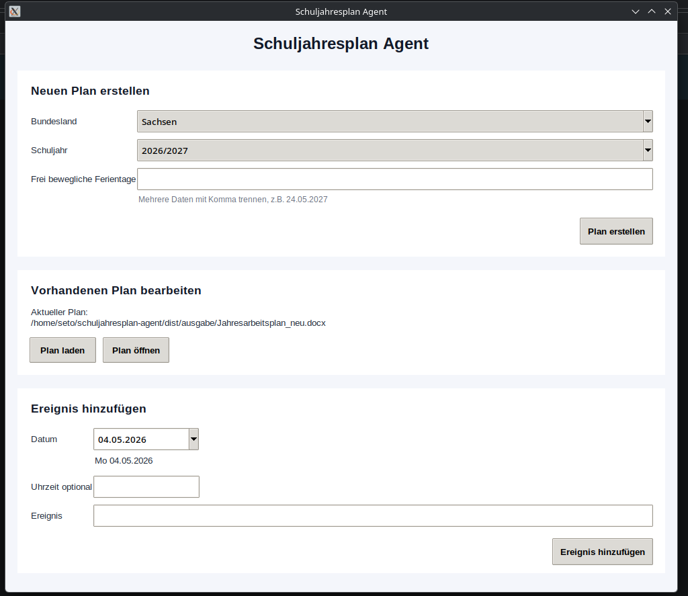

## Vorschau

# Schuljahresplan Agent

Desktop-Anwendung zur Erstellung von Schuljahresplänen als Word-Dokument.

## Funktionen

- Erstellung von Schuljahresplänen als `.docx`
- automatischer Abruf von Schulferien und Feiertagen
- Bundesland- und Schuljahr-Auswahl
- Verwaltung eigener Ereignisse
- Plan laden und bearbeiten
- automatische Backups
- Windows- und Linux-Unterstützung

## Installation

pip install -r requirements.txt
python agent.py

Build

Windows
pyinstaller --onefile --noconsole --clean --noupx --name "SchuljahresplanAgent" agent.py
Linux
pyinstaller --onefile --clean --noupx --name "SchuljahresplanAgent" agent.py

Hinweis
Die Anwendung wird mit PyInstaller gebaut. Einige Virenscanner können nicht signierte EXE-Dateien fälschlicherweise melden.
Der Quellcode ist vollständig einsehbar.

Lizenz
MIT License
© 2026 Max K.

